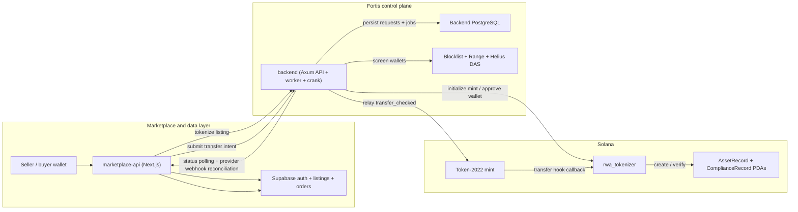

# Fortis

Fortis is a Solana monorepo for compliant real-world asset tokenization and transfer orchestration, combining a Rust control plane, a Token-2022 transfer-hook program, and a Next.js marketplace.

**Problem statement:** Fortis solves the gap between regulated asset transfers and public token movement by making wallet-level compliance approvals part of the transfer path instead of an off-chain afterthought.

## What Is Fortis?

Fortis is split into two halves:

- An off-chain control plane that accepts signed intents, persists workflow state, screens wallets, queues approvals, relays transfers, and reconciles blockchain status.
- An on-chain enforcement layer that stores mint-level asset state plus per-wallet compliance PDAs and rejects Token-2022 transfers when the required approvals do not exist.

In this repo, those responsibilities are spread across:

- `backend/` for the Rust API, worker, crank, SQLx/Postgres state, compliance checks, and blockchain submission logic.
- `contracts/` for the Anchor workspace and the `rwa_tokenizer` transfer-hook program.
- `marketplace-api/` for the Next.js marketplace, wallet-first auth, listings, and order tracking.
- `supabase/` plus `marketplace-api/supabase/` for local Supabase CLI configuration.

## Why Solana

Other networks can represent tokenized assets, but Fortis is built around Solana because the product needs fast marketplace interactions and token-level compliance enforcement at the same time:

- Fast confirmation keeps listing and purchase flows responsive instead of making the UI feel batch-driven.
- Low transaction costs make repeated wallet approvals, compliance state changes, and token relays economically practical.
- Token-2022 and transfer hooks let Fortis enforce policy where the transfer actually happens, not only in an API gateway.
- Solana fits Fortis's split architecture well: off-chain services can do screening, retries, and orchestration, while on-chain code remains the final enforcement point.
- The program model maps cleanly to mint-level asset records plus per-wallet compliance PDAs, which is the core control Fortis needs.

## Repository Layout

| Path | Purpose |
| --- | --- |
| `backend/` | Rust backend service with Axum routes, worker, stale-transaction crank, SQLx migrations, compliance screening, wallet approvals, and Token-2022 relay logic |
| `backend/migrations/` | Backend state schema for `transfer_requests`, `wallet_approvals`, `wallet_risk_profiles`, and `blocklist` |
| `contracts/` | Anchor workspace, tests, and scripts for Solana development |
| `contracts/programs/rwa_tokenizer/` | Transfer-hook program that owns `AssetRecord` and `ComplianceRecord` PDAs |
| `contracts/tests/` | Integration tests for mint setup, approval, transfer success, revocation, and blocked transfer paths |
| `contracts/scripts/` | Helper scripts such as `initialize-mint.ts` for manual mint setup |
| `marketplace-api/` | Next.js marketplace app with listing creation, SIWS-style wallet auth, order submission, and order refresh logic |
| `marketplace-api/supabase/` | Marketplace Supabase config and migrations for users, listings, orders, storage, and wallet-first auth |
| `supabase/` | Separate repo-root Supabase CLI scaffold for root-level local tooling |
| `docs/` | Expanded architecture, workflow, and local development docs |
| `.env.example` | Root backend environment template |
| `docker-compose.yml` | Local PostgreSQL and backend container wiring |

## Architecture At A Glance

| Layer | Main responsibility |
| --- | --- |
| `marketplace-api` | Listing UX, wallet session handling, listing creation, order creation, and order status refresh |
| `marketplace-api/supabase` | Auth, user profile resolution, listings, orders, and storage-backed listing assets |
| `backend` | Signed intent intake, idempotency, compliance screening, wallet approval queueing, blockchain submission, retries, webhook handling, and stale recovery |
| `backend` PostgreSQL | Durable control-plane state for requests, approvals, cached risk data, and internal blocklist entries |
| `contracts/programs/rwa_tokenizer` | On-chain asset metadata, per-wallet compliance records, transfer-hook resolution, and transfer-time enforcement |

Fortis deliberately keeps screening and orchestration off chain, while keeping the final transfer allow/deny decision on chain.

## How Fortis Works

### Listing tokenization

1. A seller creates a listing in the marketplace.
2. The marketplace writes the listing to Supabase with a tokenization-in-progress status.
3. The marketplace calls `POST /listings/tokenize` on the Rust backend.
4. The backend creates a Token-2022 mint, attaches the Fortis transfer hook, initializes the asset record, approves the seller and delegate wallets, and mints the planned supply.
5. The backend returns the mint address, compliance PDAs, and setup transaction signatures.
6. The marketplace stores the mint on the listing and marks it active.

### Transfer and compliance flow

1. A buyer signs a transfer intent that includes a nonce for replay protection.
2. The marketplace verifies the signed intent, creates an order in Supabase, and submits a transfer request to the backend.
3. The backend persists the request first, keyed by `(from_address, nonce)` for idempotency.
4. The backend screens the destination wallet using the internal blocklist plus the configured compliance provider stack.
5. If the wallet passes, the backend upserts a queued wallet approval for `(token_mint, wallet)`.
6. The worker submits `approve_wallet` on the `rwa_tokenizer` program to create or refresh the wallet's compliance PDA.
7. After the approval exists on chain, the backend relays the Token-2022 transfer.
8. During the transfer, the Token-2022 hook resolves the sender and receiver compliance PDAs and rejects the move unless both sides are approved.
9. Helius or QuickNode webhooks update backend status when possible, and the stale-transaction crank polls anything stuck in `submitted`.
10. The marketplace keeps user-facing order state current by polling Fortis request status, and it also exposes a signed internal webhook route for push-based updates if an external sender is added later.




## Quick Start

Fortis is easiest to run locally as four separate pieces: backend database, Rust backend, marketplace app, and optional contract tooling.

### 1. Install prerequisites

- Rust stable and `cargo`
- Docker and Docker Compose
- Node.js and `npm`
- Solana CLI / Agave toolchain
- Anchor CLI `0.32.1`
- Optional: Supabase CLI if you want the marketplace auth/data stack locally

### 2. Start the backend

```bash
cp .env.example .env
docker compose up -d db
cd backend
cargo run
```

Before you start the backend for real work:

- Set `ISSUER_PRIVATE_KEY` in the repo-root `.env`.
- Leave `SOLANA_RPC_URL` on devnet unless you are pointing the backend at a local validator.
- If you also want Next.js on port `3000`, change backend `PORT` to something like `3002`.

Useful backend URLs if you move the backend to `3002` as suggested:

- `http://localhost:3002/health/ready`
- `http://localhost:3002/swagger-ui`
- `http://localhost:3002/api-docs/openapi.json`

### 3. Start the marketplace app

```bash
cd marketplace-api
npm install
cp .env.example .env.local
npm run dev
```

At minimum, set these in `marketplace-api/.env.local`:

- `NEXT_PUBLIC_SUPABASE_URL`
- `NEXT_PUBLIC_SUPABASE_ANON_KEY`
- `SUPABASE_SERVICE_ROLE_KEY`
- `FORTIS_ENGINE_URL` pointing at the Rust backend, for example `http://localhost:3002`

### 4. Work on the Anchor contracts

```bash
cd contracts
npm install
anchor build
anchor test
```

If you want the backend to use your local validator and local deployment instead of devnet, update the repo-root `.env` so `SOLANA_RPC_URL=http://127.0.0.1:8899` and make sure the issuer wallet has funds on that validator.

### 5. Optional: run local Supabase for the marketplace

Use the config inside `marketplace-api/`, not the repo-root scaffold:

```bash
cd marketplace-api
supabase start
supabase status
```

Copy the reported local URL and keys into `marketplace-api/.env.local`.

## Docs Map

The root README is the fast entrypoint. The deeper docs live under [`docs/`](./docs/):

- [`docs/architecture.md`](./docs/architecture.md) - full system architecture, control boundaries, and on-chain enforcement model
- [`docs/local-development.md`](./docs/local-development.md) - prerequisites, env files, startup commands, and local pitfalls
- [`docs/workflows.md`](./docs/workflows.md) - listing tokenization, transfer orchestration, compliance approval, and reconciliation flows
- [`CONTRIBUTING.md`](./CONTRIBUTING.md) - review and contribution expectations

## Codebase Entry Points

If you are new to the repo, start with the files that define the core flow rather than reading every directory in order:

- [`backend/src/api/router.rs`](./backend/src/api/router.rs) for the public backend surface area
- [`backend/src/app/service.rs`](./backend/src/app/service.rs) for transfer intake, compliance gating, retries, and webhook reconciliation
- [`backend/src/app/worker.rs`](./backend/src/app/worker.rs) for queued wallet approvals and stale-transaction recovery
- [`backend/src/domain/types.rs`](./backend/src/domain/types.rs) for transfer intent, tokenization, and state model types
- [`backend/src/infra/blockchain/solana.rs`](./backend/src/infra/blockchain/solana.rs) for tokenization, wallet approval submission, and transfer relay behavior
- [`contracts/programs/rwa_tokenizer/src/lib.rs`](./contracts/programs/rwa_tokenizer/src/lib.rs) for the on-chain model and transfer-hook enforcement rules
- [`contracts/tests/rwa-tokenizer.ts`](./contracts/tests/rwa-tokenizer.ts) for the clearest end-to-end example of the contract flow
- [`marketplace-api/lib/services/listings.ts`](./marketplace-api/lib/services/listings.ts) for listing creation and backend tokenization handoff
- [`marketplace-api/lib/services/orders.ts`](./marketplace-api/lib/services/orders.ts) for signed intent verification, order creation, and Fortis dispatch
- [`marketplace-api/lib/services/order-updates.ts`](./marketplace-api/lib/services/order-updates.ts) for order-state mapping between backend statuses and marketplace statuses
- [`marketplace-api/lib/solana/transfer-intent.ts`](./marketplace-api/lib/solana/transfer-intent.ts) plus [`backend/src/bin/generate_transfer_request.rs`](./backend/src/bin/generate_transfer_request.rs) whenever you change signing or message formats
- [`marketplace-api/supabase/migrations/`](./marketplace-api/supabase/migrations/) for the marketplace data model and wallet-first auth setup

## Notes For Contributors

- The backend and the marketplace do not share a database. Backend operational state lives in PostgreSQL; user-facing marketplace state lives in Supabase.
- The current marketplace purchase flow is buyer-initiated: the signed transfer intent proves the buyer wallet and nonce, and the marketplace currently passes the buyer wallet as both `from_address` and `to_address` while `source_owner_address` identifies the seller-held token account that Fortis will debit through the delegate flow.
- The marketplace currently refreshes Fortis order state by polling `GET /api/orders/:id`. The signed internal Fortis webhook route exists, but backend-originated callbacks are not implemented in this repo today.
- If you change transfer policy, review the backend, marketplace order flow, and `rwa_tokenizer` program together. Fortis is intentionally split across those layers.

Fortis is licensed under [MIT](./LICENSE).
