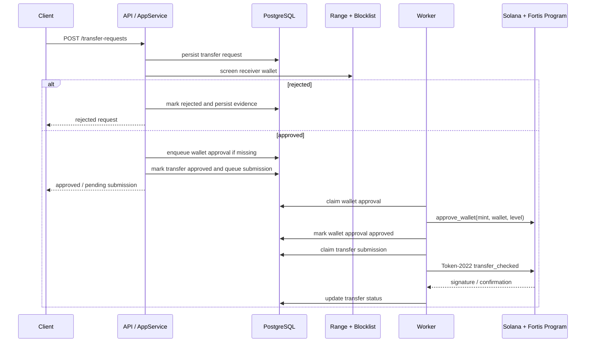

# Architecture

## High-level flow

## Backend modules

- `src/app/service.rs`: request intake, screening, queueing, retry behavior
- `src/app/worker.rs`: background worker that processes approvals first, then transfers
- `src/domain/types.rs`: transfer and wallet-approval DTOs, signing format, PDA helpers
- `src/infra/blockchain/solana.rs`: public Token-2022 relay and manual `approve_wallet` instruction builder
- `src/infra/database/postgres.rs`: transfer and wallet-approval persistence
- `src/infra/compliance/range.rs`: wallet-centric Range screening
- `src/api/*`: HTTP routes, webhook handlers, and admin endpoints

## Data model

- `transfer_requests`: user request lifecycle and frozen compliance evidence
- `wallet_approvals`: per-wallet Fortis approval queue and audit trail
- `blocklist`: internal denylist
- `wallet_risk_profiles`: cached risk metadata

## Design constraints

- The request path never submits a chain transaction directly.
- Wallet approval and transfer relay are decoupled for retry safety.
- The backend manually builds the Anchor instruction to avoid `anchor-client` version coupling.
