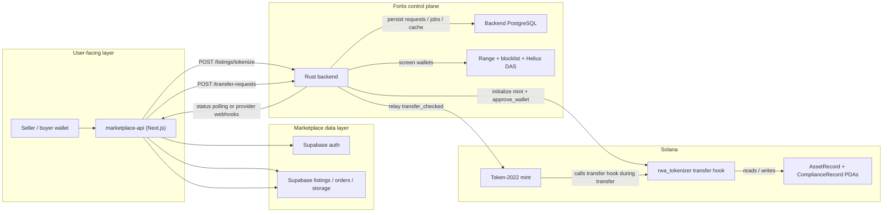

# Fortis Architecture

## Overview

Fortis is a split system for compliant RWA tokenization on Solana:

- The marketplace app handles user-facing listing and order flows.
- Supabase handles marketplace auth and user-facing data.
- The Rust backend acts as the Fortis control plane.
- PostgreSQL stores backend workflow state and audit history.
- The `rwa_tokenizer` Anchor program enforces transfer compliance on chain.

That split is intentional. Compliance decisions, retries, screening integrations, and operational recovery are easier to manage off chain. Transfer enforcement, however, must survive client bugs or operator mistakes, so the last allow/deny decision lives on chain inside the Token-2022 transfer-hook path.

## Component Map

| Component | What it does | What it does not do |
| --- | --- | --- |
| `marketplace-api/` | Renders the marketplace UI, authenticates wallets, creates listings, creates orders, verifies signed intents before forwarding them, and refreshes order status | Does not decide compliance or submit Solana transactions directly |
| `marketplace-api/supabase/` | Defines marketplace tables and policies for `users`, `listings`, `orders`, and storage-backed assets | Does not store backend worker state or blockchain retry metadata |
| `backend/` | Accepts transfer requests, persists them with idempotency, screens wallets, queues approvals, submits on-chain instructions, processes provider webhooks, and runs stale recovery | Does not serve the marketplace UI or own user-facing listings/orders tables |
| `backend` PostgreSQL | Stores `transfer_requests`, `wallet_approvals`, cached `wallet_risk_profiles`, and internal `blocklist` entries | Does not replace the marketplace's Supabase schema |
| `contracts/programs/rwa_tokenizer/` | Stores `AssetRecord` and per-wallet `ComplianceRecord` PDAs and enforces transfer rules via a Token-2022 transfer hook | Does not run screening logic or retries |

## System Diagram

## Off-chain vs On-chain Responsibilities

### Off-chain responsibilities

The off-chain system is responsible for anything that depends on external data, operational sequencing, or recovery logic:

- Accepting signed transfer intents and verifying signature format
- Enforcing nonce-based idempotency and replay protection
- Screening wallets against the internal blocklist and external compliance providers
- Caching risk results and tracking approval / transfer retries
- Deciding when a wallet needs an on-chain compliance record
- Submitting `approve_wallet` and transfer transactions
- Reconciling blockchain status through provider webhooks and polling

### On-chain responsibilities

The on-chain system is responsible for the part that must remain true at transfer time even if the caller is buggy or malicious:

- Storing mint-level `AssetRecord` metadata
- Storing per-wallet `ComplianceRecord` PDAs keyed by `(mint, wallet)`
- Resolving required extra accounts for the transfer hook
- Rejecting Token-2022 transfers when the sender or receiver compliance record is missing, revoked, or otherwise invalid

## Marketplace App

`marketplace-api/` is the user-facing entrypoint.

Today it does four important things:

1. Listing creation
   It inserts a listing into Supabase, marks it as `tokenizing`, and asks the backend to tokenize it.

2. Wallet-first auth
   The app uses Supabase-backed wallet identity resolution and SIWS-style flows rather than email/password-first onboarding.

3. Order creation
   It validates the buyer's signed transfer intent, creates an order record, and forwards the request to Fortis.

4. Order refresh
   It polls Fortis request status when the buyer asks for an order and maps backend states such as `pending_submission`, `submitted`, `confirmed`, `failed`, and `expired` into marketplace order states.

An important implementation detail: in the current marketplace demo flow, the buyer signs the purchase intent, while `source_owner_address` points to the seller wallet that currently holds the tokenized asset. That lets the backend relay the seller-side transfer through the Fortis delegate model after the buyer has been screened and approved.

## Supabase Auth and Data Layer

The marketplace keeps its user-facing state in Supabase, not in the backend Postgres database.

Current schema responsibilities include:

- `users`
  Wallet-linked marketplace identity and profile data

- `listings`
  Seller-owned marketplace listings, tokenization status, and token mint linkage

- `orders`
  Buyer-visible order records, mapped Fortis request IDs, status, and error text

- Storage policies
  Listing media uploads and public reads

This separation keeps product data and control-plane state independent. The marketplace can evolve UI, auth, and listing semantics without forcing the backend workflow schema to absorb user-facing concerns.

## Rust Backend Control Plane

`backend/` is the operational center of Fortis.

Its main API surface is:

- `POST /listings/tokenize`
- `POST /transfer-requests`
- `GET /transfer-requests`
- `GET /transfer-requests/:id`
- `POST /transfer-requests/:id/retry`
- `POST /risk-check`
- Provider webhook endpoints under `/webhooks`

The backend follows a receive, persist, process model for transfer requests:

1. Validate and verify the signed request.
2. Check `(from_address, nonce)` for idempotency.
3. Persist the transfer request before compliance work starts.
4. Screen the relevant wallet.
5. Queue or reuse a wallet approval job.
6. Queue the transfer for worker submission.

This gives Fortis an audit trail even if screening, submission, or external providers fail later.

### Worker and crank

The backend runs two background loops:

- Worker
  Processes queued `wallet_approvals`, then processes `transfer_requests` that are ready for on-chain submission.

- Stale transaction crank
  Polls transfers stuck in `submitted` longer than the configured threshold and reconciles them to `confirmed`, `failed`, or `expired`.

That crank is the fallback when provider webhooks are delayed, dropped, or incomplete.

## PostgreSQL Backend State

The backend migration currently creates four core tables:

- `transfer_requests`
  The durable lifecycle record for every submitted transfer intent, including nonce, compliance status, blockchain status, signatures, retries, and blockhash tracking.

- `wallet_approvals`
  The queue and audit log for per-wallet compliance approvals that must exist on chain before a transfer can proceed.

- `wallet_risk_profiles`
  Cached screening results used by the risk-check flow.

- `blocklist`
  Internal operator-managed or auto-populated blocked wallet state.

This database is the source of truth for backend workflow progression. It is separate from the marketplace's Supabase schema by design.

## Solana Program and On-chain Enforcement

The `rwa_tokenizer` program is the enforcement layer.

Important on-chain objects:

- `AssetRecord`
  Mint-level metadata for the tokenized asset, including name, asset type, valuation, and document references

- `ComplianceRecord`
  Per-wallet approval state for a specific mint

- `ExtraAccountMetaList`
  The account-resolution metadata that tells Token-2022 which Fortis PDAs must be available during transfer-hook execution

Important instructions:

- `initialize_asset`
- `approve_wallet`
- `revoke_wallet`
- `initialize_extra_account_meta_list`

The transfer hook checks both sides of the transfer. A transfer is not considered compliant just because the recipient is approved; the sender and receiver compliance PDAs both need to resolve correctly at transfer time.

## How Compliance State Is Created

Compliance state is created in two stages.

### During listing tokenization

When the marketplace asks the backend to tokenize a listing, the backend:

1. Creates the Token-2022 mint with the Fortis transfer hook attached.
2. Initializes the mint's `AssetRecord`.
3. Initializes the extra account meta list used by the hook.
4. Creates compliance approvals for the seller wallet and the Fortis delegate wallet.
5. Mints the planned supply to the seller.

This ensures the original distribution path already has the required sender-side approvals in place.

### During transfer orchestration

When a new buyer-side transfer request arrives, the backend:

1. Screens the destination wallet.
2. Upserts a `wallet_approvals` record for `(token_mint, wallet)`.
3. Has the worker submit `approve_wallet` to create or refresh the on-chain `ComplianceRecord`.
4. Only then submits the Token-2022 transfer relay.

The control plane decides who should be approved, but the transfer hook decides whether the transfer is allowed at the moment of execution.

## Main Flows

### Tokenization flow

1. The seller creates a listing in the marketplace.
2. Supabase stores the listing with a tokenization-in-progress status.
3. The marketplace calls `POST /listings/tokenize`.
4. The backend initializes the mint, transfer hook, asset metadata, and initial approvals.
5. The backend returns mint and PDA metadata.
6. The marketplace stores those references and marks the listing active.

### Transfer and compliance flow

1. The buyer signs a nonce-bound intent.
2. The marketplace verifies the signature and creates an order.
3. The backend persists the request with status `received`.
4. The backend screens the wallet and upserts a wallet approval job.
5. The worker submits `approve_wallet`.
6. The worker relays the Token-2022 transfer.
7. The transfer hook resolves the sender and receiver compliance PDAs.
8. The transfer succeeds only if both PDAs are approved and valid.

### Status reconciliation flow

1. Submitted transactions can be confirmed by provider webhooks from Helius or QuickNode.
2. If those webhooks do not arrive, the stale crank polls for old `submitted` transfers.
3. The backend updates the lifecycle record to `confirmed`, `failed`, or `expired`.
4. The marketplace maps backend lifecycle status into order-facing status on read.

## Key Design Decisions

- Separate user-facing marketplace data from backend workflow state.
- Persist transfer requests before compliance checks so failures remain auditable.
- Use per-wallet compliance PDAs rather than a large on-chain whitelist account.
- Keep screening logic off chain, but keep the final transfer gate on chain.
- Use provider webhooks plus active polling so transaction state can heal even when callbacks fail.
